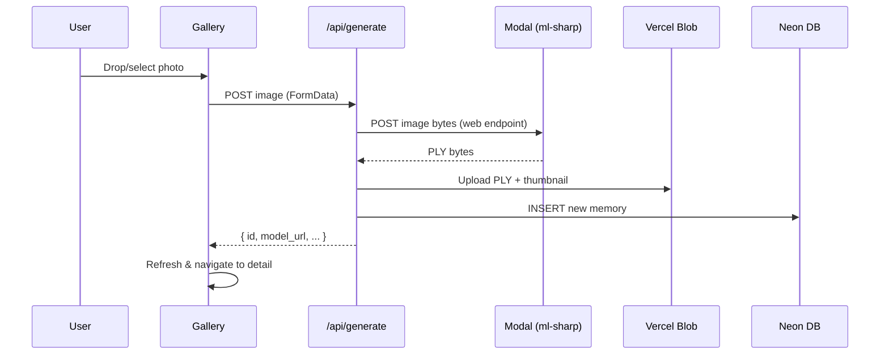

# Frontend Integration: ml-sharp Upload → 3D Memory

Upload a photo on the gallery page → run ml-sharp on Modal → create a new memory entry with the generated PLY model.

## Proposed Changes

### API Layer

#### [NEW] [route.ts](file:///Users/astra/Documents/GitHub/memories-relive/src/app/api/generate/route.ts)
New `POST /api/generate` endpoint that orchestrates the full flow:
1. Receive uploaded image (multipart/form-data)
2. Call Modal's ml-sharp function via HTTPS (`predict_gaussian_splat.remote()`)  
3. Upload the returned PLY to Vercel Blob
4. Create a new memory record in Neon DB (with `model_url` pointing to the blob)
5. Upload the original image as thumbnail to Vercel Blob
6. Return the new memory ID + status

> [!IMPORTANT]
> This requires a **Modal web endpoint** instead of `modal run`. We need to convert `mlsharp_app.py`'s function to a `@app.function()` with a `web_endpoint` decorator, OR use Modal's Python client from a separate API endpoint.
> 
> **Recommended approach**: Add a new Next.js API route that shells out to `modal run` with the image, OR use Modal's REST API. Since the frontend is on Vercel and can't run Python, the cleanest path is to **deploy the Modal function as a web endpoint** and call it via HTTP from the Vercel API route.

---

### Modal Backend

#### [MODIFY] [mlsharp_app.py](file:///Users/astra/Documents/GitHub/memories-relive/modal_backend/mlsharp_app.py)
Add a `@modal.web_endpoint()` decorator to expose `predict_gaussian_splat` as an HTTPS endpoint that Vercel can call:
- Accept `POST` with multipart image upload
- Return PLY bytes as response
- Deploy with `modal deploy` for persistent endpoint

---

### Frontend Components

#### [MODIFY] [Gallery.tsx](file:///Users/astra/Documents/GitHub/memories-relive/src/components/dom/Gallery.tsx)
Wire up the existing upload popover:
- Add file input + drag-drop support (currently placeholder)
- On file select: show upload progress → call `/api/generate` → on success, refresh gallery and navigate to new memory
- Add loading/processing states with animation
- Handle errors gracefully

---

### Store

#### [MODIFY] [index.ts](file:///Users/astra/Documents/GitHub/memories-relive/src/store/index.ts)
Add `generateMemory` async action:
- Takes `File` object
- Calls `/api/generate` with FormData
- Adds the new memory to the store
- Sets `viewMode: 'detail'` + `activeMemoryId` to navigate to it

---

## Data Flow

## Verification Plan

### Automated Tests
- `npm run build` — ensure no TypeScript errors
- Browser test: upload test image, verify memory appears in gallery

### Manual Verification
- Upload a real photo → confirm PLY generates and displays in 3D viewer
- Verify loading states and error handling
